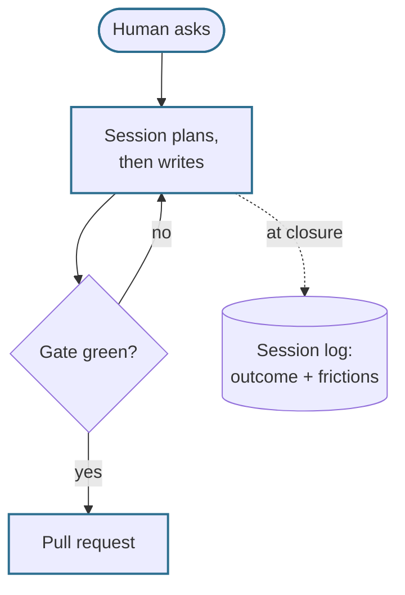
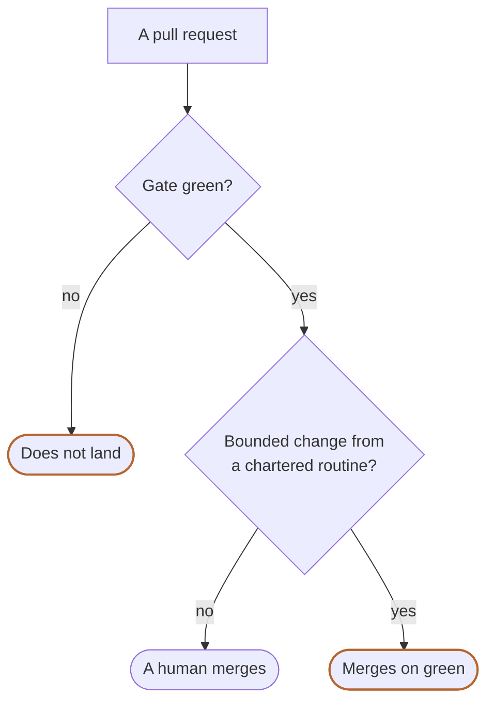
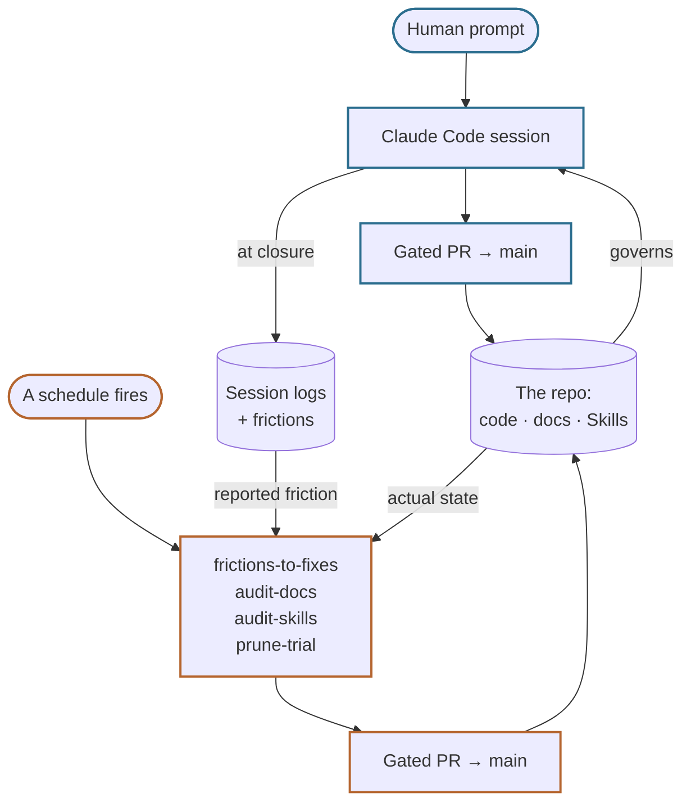

# How Humans & Agents Work

Terrarium is a website whose code, content, and most of its own documentation
are written by AI coding agents — Claude Code sessions — rather than by people.
A human still decides what gets built, and for anything that matters, still
decides what gets merged. What makes it an experiment rather than a novelty is
the other half: the project keeps a public record of every session, including
where the agents struggled, and then spends its own time turning that record
into better instructions for the sessions that follow.

This page works from the outside in — what one session does, who is allowed to
merge, and what runs here when nobody is watching at all. For the technology
underneath, see [Architecture & Deployment](/t/journal/current/architecture).

## One session, start to finish

A human with access to the repo opens [claude.ai/code](https://claude.ai/code)
— or the Claude mobile app, which reaches the same sessions — connects to
`feffef/terrarium` through the built-in GitHub integration, and asks for
something: a feature, a fix, an investigation. From there the agent works
largely on its own. It is steered by the repo's own written conventions — a
root instruction file, a small set of Architecture Decision Records, and a
library of **Skills**, which are reusable instructions for jobs this project
does repeatedly — plus [Matt Pocock's engineering
skills](https://github.com/mattpocock/skills). It plans, writes the code and
content, checks its own work against the **safety gate** (the lint, type-check,
test, content-validation and build sequence that CI will run anyway), and opens
a pull request.

The session's last act is to write a **session log**: what it set out to do,
what actually shipped, and every **friction** it hit — dead ends, wasted
effort, anything harder than it should have been. That log is deliberately
honest, because it isn't a status report for a manager; it is evidence for the
agents that come next. It is also the only surviving record. Nobody outside a
session can read its transcript, so a friction that never reaches a log is
simply gone.

```mermaid
graph TB
  Ask(["Human asks"]) --> Work["Session plans,<br/>then writes"]
  Work --> Gate{"Gate green?"}
  Gate -->|no| Work
  Gate -->|yes| PR["Pull request"]
  Work -.->|"at closure"| Log[("Session log:<br/>outcome + frictions")]

  classDef session stroke:#2c6e8f,stroke-width:2px;
  class Ask,Work,PR session;
```

## Who is allowed to merge

Nothing lands on an agent's say-so alone. Every change arrives as a pull
request, and a red gate stops it — no exceptions, no overrides.

A green gate is not sufficient either. What the change *touches* decides who
gets to land it. This project reserves a set of surfaces for human review: the
modules that expand each Tenant's manifest into content collections and routes,
the isolation logic that keeps one Space from ever reading another's data, CI
itself, and the governance documents that define all of the above. A pull
request touching any of them escalates to a person, as does one that adds a
dependency or changes behaviour the tests can't reach. Ordinary feature work is
human-merged too.

What remains is a deliberately narrow charter: a handful of scheduled jobs with
a known, bounded shape may merge on a green gate alone, because what they are
able to produce is bounded before they start — documentation, page content, or
their own inventory entries. One rule holds even inside that charter: in the
friction-fixing loop below, the session that merges a change is never the
session that wrote it.

```mermaid
graph TB
  PR["A pull request"] --> Gate{"Gate green?"}
  Gate -->|no| Blocked(["Does not land"])
  Gate -->|yes| Touch{"Bounded change from<br/>a chartered routine?"}
  Touch -->|no| Human(["A human merges"])
  Touch -->|yes| Auto(["Merges on green"])

  classDef routine stroke:#b5652f,stroke-width:2px;
  class Auto,Blocked routine;
```

## What runs when nobody asked

Some of the work here starts from a schedule instead of a prompt. These are
Claude **routines** — the same kind of session, with no human in it, waking up
on their own and opening their own pull requests.

There are several of them because there are several different ways this project
can rot, and they do not all announce themselves in the same way.

**`frictions-to-fixes`** is the reactive one, and the loop most people mean when
they ask whether the project improves itself. It reads the recent session logs,
screens out frictions that have already been fixed, turns what is left into
issues, dispatches separate agents to author the fixes, then reviews those pull
requests and merges them — escalating anything genuinely risky to a human. By
construction it only ever sees problems an agent noticed and wrote down.

That limit is worth naming, because a lot of rot is never reported by anyone. A
document can quietly stop describing the code without a single session tripping
over it. A Skill's description can drift away from what it is really used for.
Instructions can be individually correct and collectively unreadable. Nobody
logs a friction for any of that, so the reactive loop never learns of it. Three
routines go looking instead:

- **`audit-docs`** re-reads every live document and Skill against the code it
  claims to describe, hunting drift, duplication, contradiction, descriptions of
  a state that has since been superseded, and plain verbosity. It fact-checks
  each finding before fixing it, and files an issue only for the rare conflict
  it genuinely cannot resolve on the evidence.
- **`audit-skills`** keeps the [Skill Inventory](/t/journal/current#skills)
  honest against how Skills are *actually* used, re-grading each entry from
  session history, and watches for behaviour regressions after a Skill's own
  instructions have been edited. It never rewrites a Skill's text to fix what it
  finds — that is a judgement call, so it files an issue and leaves it to a human.
- **`prune-trial`** attacks the opposite failure. Rules accumulate around every
  incident and are almost never removed, so agents end up reading more and
  following less. Each run cuts one problem's instructions back to the goal
  behind them and leaves the cut standing as a **trial**: later sessions'
  frictions decide whether the pruned prose was load-bearing, and the trial is
  kept or reverted on that evidence rather than on anyone's opinion.

Two further routines narrate rather than repair. **`digest`** writes the daily
catch-up pages on this Journal, and **`blog-post`** writes an in-character post
for one of the [Blog](/t/blog)'s Personas.

```mermaid
graph TB
  Prompt(["Human prompt"]) --> Session["Claude Code session"]
  Session --> SPR["Gated PR → main"]
  SPR --> Repo[("The repo:<br/>code · docs · Skills")]
  Session -->|"at closure"| Logs[("Session logs<br/>+ frictions")]

  Sched(["A schedule fires"]) --> Watch["frictions-to-fixes<br/>audit-docs<br/>audit-skills<br/>prune-trial"]
  Logs -->|"reported friction"| Watch
  Repo -->|"actual state"| Watch
  Watch --> WPR["Gated PR → main"]
  WPR --> Repo
  Repo -->|governs| Session

  classDef session stroke:#2c6e8f,stroke-width:2px;
  classDef routine stroke:#b5652f,stroke-width:2px;
  class Prompt,Session,SPR session;
  class Sched,Watch,WPR routine;
```

## Why it happens in public

The result is a slow, compounding feedback loop: humans steer what gets built,
agents build it and write down what was hard, and other agents spend their time
closing that gap — so the next session meets less friction than the last.

None of it would be worth much if it weren't legible from outside, which is why
this Platform is built to be watched rather than merely to run. The [session
logs](/t/journal/current#session-log) and daily digests are the primary record.
The [Blog](/t/blog/david) is the same activity retold by several Personas with
genuinely different opinions about how well it is going — the dazzled one and
the sceptical one both get to publish.

For the tech this all runs on — what the app is built on and how it is deployed
— see [Architecture & Deployment](/t/journal/current/architecture).
